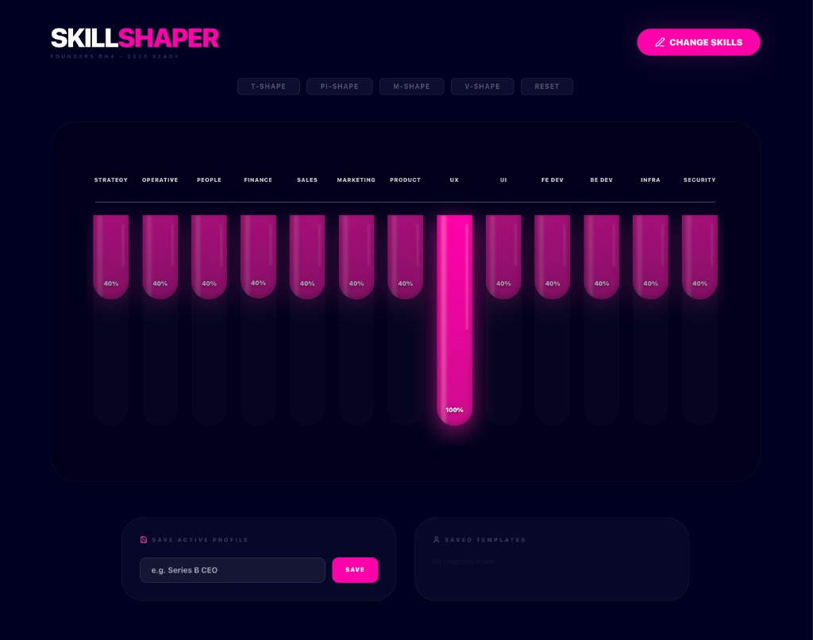

# SkillShaper Pro (2026)

SkillShaper is a small, fast web app for **visualizing “talent shapes”** (breadth vs. depth) like **T‑shaped**, **Pi‑shaped**, **M‑shaped**, and **V‑shaped** skill profiles. It’s designed for founders, CEOs, and team leads who want a clean artifact for conversations, hiring, and skill planning.

## Open the app (live)

**Try it now:** https://machal.github.io/skill-shaper-app/

[](https://machal.github.io/skill-shaper-app/)

## Key features

- **Dynamic columns:** Drag-to-resize skill depth with plastic visual effects.
- **Archetype presets:** Instant transformation into T-shape, M-shape, or V-shape profiles.
- **CEO defaults:** Pre-configured with essential startup leadership domains.
- **Persistence:** Save and load custom profiles using LocalStorage.
- **Minimalist UI:** Built with the ps.one brand palette (dark blue and pink).

## Tech stack

- React (Vite)
- Tailwind CSS
- Lucide Icons

## Local development

```bash
npm install
npm run dev
```

## GitHub Pages

This repo is set up for **machal** / **skill-shaper-app**. For a fork, adjust URLs and paths to match your GitHub username and repo name.

1. Create a repository on GitHub (e.g. `skill-shaper-app`).
2. Set `package.json` → `"homepage"` to `https://<username>.github.io/<repo>/`.
3. In `vite.config.ts`, set `GH_PAGES_BASE` to `'/<repo>/'` (must match the repo name).
4. Push your code, then run:

```bash
npm run deploy
```

The site is published from the `gh-pages` branch via the `dist` folder.

## Sources / further reading

These shapes are widely used as **communication tools** for skill breadth/depth. If you want background context, start here:

- **T‑shaped skills**: Wikipedia overview: https://en.wikipedia.org/wiki/T-shaped_skills
- **General “skills profile” framing**: Wikipedia on competence: https://en.wikipedia.org/wiki/Competence_(human_resources)

If you have a preferred canonical source for Pi/M/V/M‑shaped models in your domain, open an issue and we’ll link it here.

## Usage

1. Use **Change Skills** to edit the horizontal axis labels.
2. Drag the pink columns to set expertise depth.
3. Save snapshots for presentations using the **Profiles** panel.
